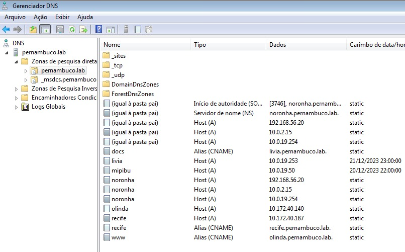
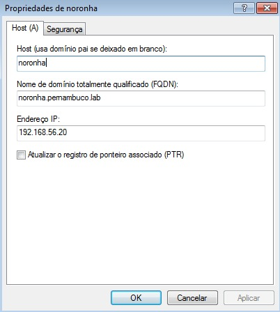
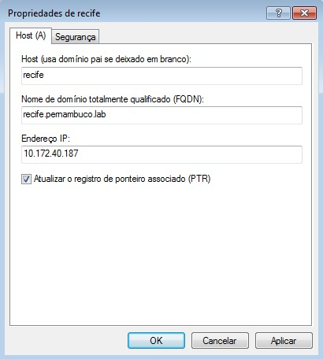
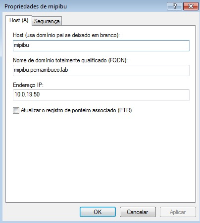
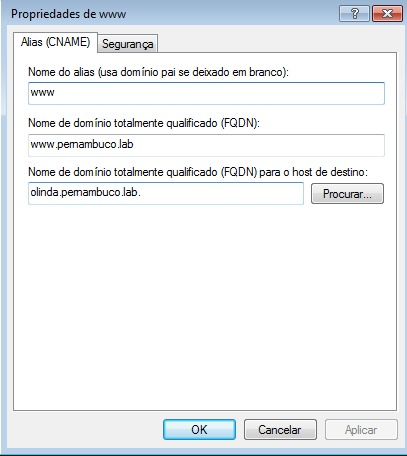
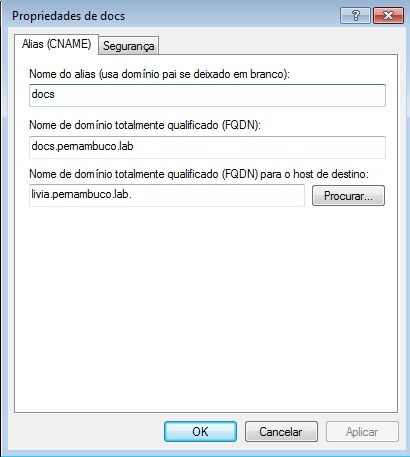

# DNS

<b> Compreensão geral do serviço DNS: </b>

O DNS converte nomes de domínio, como www.example.com, em endereços IP.

## Instalação

Integramos o DNS com o Samba.
Por isso, foi preciso configurar o Samba.

## Configuração

Incluir o(s) nome(s) e o conteúdo do(s) arquivo(s) de configuração.

Cinco registros (4 pontos cada):

- 3 do tipo A (Endereços);
- 2 do tipo CNAME (`www` e `docs`);

## Teste

<b> Gerenciador DNS: </b>

##

<b> Registros tipo A: </b>

Os registros do tipo A associam um nome de domínio a um endereço IP. 

Eles são usados para direcionar o tráfego para um site ou serviço específico.

##

<b> Registros tipo CNAME: </b>

Os registros do tipo CNAME associam um nome de domínio ou subdomínio a outro nome de domínio. 

Eles são usados para criar aliases para nomes de domínio

##

