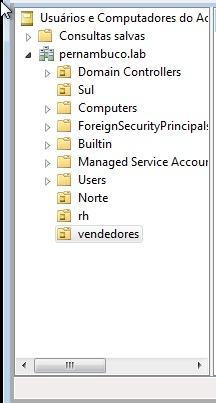
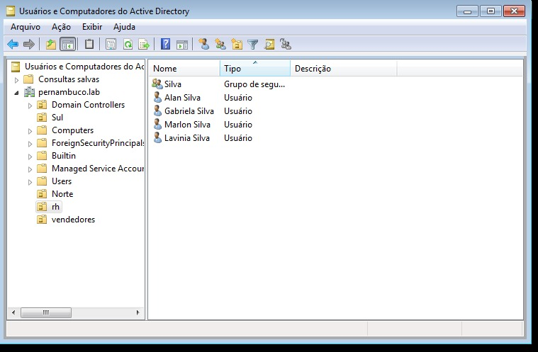
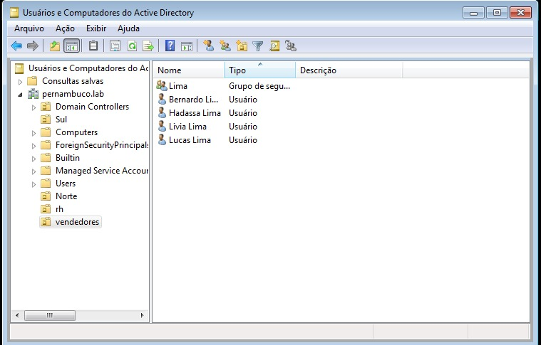

# LDAP

<b>Quando utilizar o LDAP?</b>

O LDAP é usado para armazenar e gerenciar dados sobre pessoas, organizações e outros recursos. Esses dados podem incluir nomes, endereços de e-mail, números de telefone, funções, grupos de usuários e muito mais.

## Instalação

Integramos o LDAP com o Samba.
Portanto, permitiu que os usuários sejam autenticados e autorizados usando um servidor LDAP.

## Configuração

Incluir o(s) nome(s) e o conteúdo do(s) arquivo(s) de configuração.

- Criar duas OU: `vendedores` e `rh`;
- Mover o grupo `sobrenome1` e seus membros para a OU `vendedores`;
- Mover os grupo `sobrenome2` e seus membros para a OU `rh`.

## Teste

Criação da Organizational Unit, que sifnifica Unidade Organizacional, mas para facilar vamos chamar pela sigla "OU".

1. Criamos as OU por nome: vendedores" e "rh":

2. Em seguida movi o sobrenome <b>silva</b> para OU rh:

2. Em seguida movi o sobrenome <b>lima</b> para OU vendedores:

