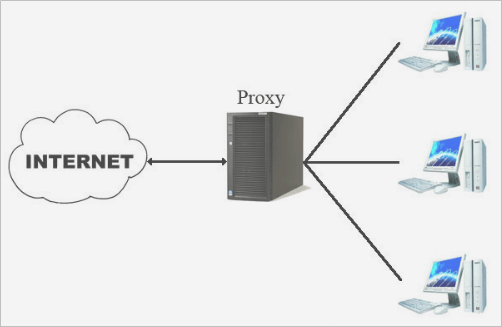

# PROXY SQUID

<b> O QUE É O PROXY SQUID? </b>

É um servidor de proxy open source amplamente no Linux.
Muito importante para a função de armazenamento em cache do conteúdo da web acessado pelos usuários.

<b> OBS: </b> Os proxies podem usar ACLs para controlar o acesso a recursos internos da rede, como servidores, pastas ou arquivos.

<B> MAS O QUE É ACL? </B>

<B> ACL: </B> <I> LISTA DE CONTROLE DE ACESSO </I>

Ou seja, São listas de regras que definem quais clientes podem acessar quais recursos. 

Por exemplo, uma empresa pode usar um <I> <U> proxy</U></I> para bloquear o acesso a sites de redes sociais ou de streaming de vídeo. Para isso, a empresa criaria uma <I> <U> ACL</U></I> que bloqueia as URLs desses sites.

## Instalação

Para instalar o squid no linux utilizamos o comando:

`apt install squid`

<B> OBS: </B> Para atualizar o sistema digite:

`sudo apt update`

Por vezes o squid nega o acesso quando é instalado, então vamos precisar desabilitar: 

`/etc/squid/squid.conf`

Para isso, identifique uma linha que diz: 

<i> http access deny all </i>

e substitua a palavra deny por allow.
Dessa forma:

<i> http access allow all </i>

<b> Traduzindo: </b>

DENY: negar

ALLOW: permitir

## Configuração

No ato da instalação foi criado o arquivo diretório chamado:

debian.conf 

(esse nome pode variar, mas estou se referindo ao meu diretório)

- No 'debian.conf' será adicionado nossa ACL:

`acl NOME_DA_ACL TIPO_DA_ACL parâmetro`

<b> AGORA VAMOS VER ALGUNS TIPOS DE ACL:</b> 

- <b> dst </b> = O destino pode um host,rede ou domínio.

ex: </b> acl exemplo dst www.facebook.com

 exemplo foi o NOME_DA_ACL

 dst foi o TIPO_DA_ACL

- <b> url </b> = Especifica o URL de uma solicitação HTTP. 

O URL pode ser um URL completo ou um prefixo de URL.

Por exemplo, para bloquear uma palavra usando a ACL tipo URL. Podendo usar a diretiva url_regex para especificar a palavra ou frase que deseja bloquear.

 Imagine a situação que os pais querem bloquear no computador do seu filho toda a palavra "sexo", nesse caso, é só criar a seguinte ACL:

``acl block_sexo url_regex "sexo"``

- <b> port </b> = O parâmetro será uma porta ex: 3128

Para alterar a porta do Squid, localize a linha 
`http_port 3128`
no arquivo de configuração. Altere o número da porta para o número que você deseja usar.

<b> OBSERVAÇÃO: </b>

Depois de adicionar a ACL ao arquivo de configuração, você precisará reiniciar o Squid para que as alterações tenham efeito. 

Para reiniciar o Squid, execute o seguinte comando:

``sudo systemctl restart squid``

Ainda sobre os aquivos de configuração, 
é importante saber alguns comando para:

- habilitar 

`sudo service squid enable`

- desabilitar

`sudo service squid disable`

- iniciar

`sudo service squid start`

- parar 

`sudo service squid stop`

- testar

``curl http://localhost:3128``

- recarregar 

`` sudo service squid reload ``

<B> VEJA TAMBÉM: </B>

<B> Como acompanhar os logs (registro) de acesso: </B>

- `tail -n 200 /var/squid/logs/access.log` 
 
pois através do tail ele permite visualizar as últimas linhas de um arquivo. 

## Teste

<b> 4 ACLS QUE FOI CONFIGURADA EM SALA DE AULA: </b>

1. <b> acl bloqueio dstdomain .youtube.com .facebook.com .gov.com .suap.com </b>

http_access deny site 

(acl tipo dst)
portanto, bloqueamos o acesso a esses sites pelo proxy squid. 

2. <b> acl protocolo src 52.95.188.10 </b>

http_access deny protocolo

acl do tipo src.

Ou seja, a ACL "protocolo" identifica o tráfego proveniente do endereço IP 52.95.188.10.

A regra http_access deny protocolo bloqueia todo o tráfego HTTP proveniente desse endereço IP.

Na prática, pode ser uma medida de segurança para bloquear tráfego malicioso ou indesejado.

3. <b> acl tempo time MTWHF 05:00-22:00</b>

http_access allow tempo

Nesse caso, o tipo da acl é tempo.

E foi adicionado as seguintes informações no comando acima: 

- <b>Nome:</b> tempo

- <b>Tipo:</b> time (tempo)

- <b>Dias da semana:</b> MTWHF (segunda a sexta)

- <b>Horário:</b> 05:00-22:00

Essa ACL permite acesso somente nos dias de segunda a sexta, entre as 5h da manhã e as 22h da noite.

4. <b> acl site browser Firefox </b>

http_access deny bloqueio

Essa ACL identifica requisições que são feitas especificamente pelo navegador Firefox.

A ACL bloqueia o acesso a todos os sites, independentemente da URL, quando acessados pelo Firefox.

Lembrando que a regra não afeta o acesso por outros navegadores, como Chrome, Edge, etc.

<B> FEITO O TESTE TENTANDO ACESSAR O FIREFOX:</B>

E como vocês podem ver apareceu a seguinte mensagem:

<i> The proxy server is refusing connections </i>

Que em português significa:

<i> O servidor proxy está recusando conexões </i>

