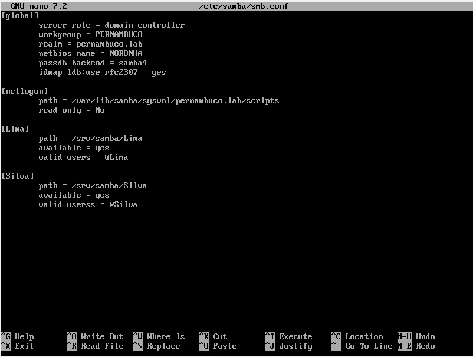
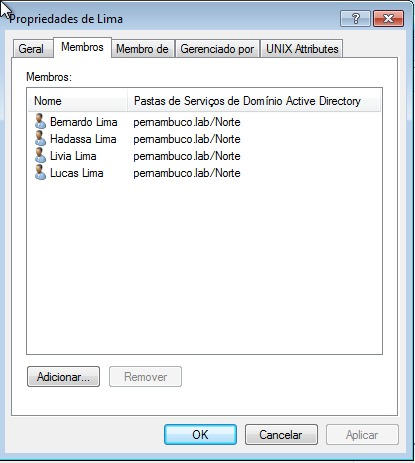
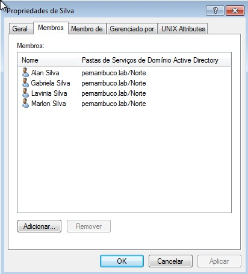
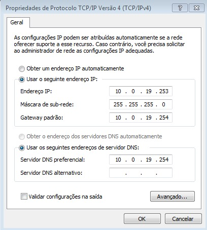
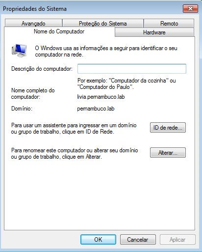

# SAMBA

<B> O que seria o Samba? </B>

O Samba é um software servidor que permite compartilhar arquivos, impressoras e outros recursos em redes formadas por computadores com diferentes sistemas operacionais.

<B>  - Compartilhamento de arquivos: </B>  o Samba permite compartilhar arquivos entre computadores em uma rede. Os arquivos compartilhados podem ser acessados ​​por qualquer computador que tenha o Samba instalado.

<B> - Compartilhamento de impressoras: </B> o Samba permite compartilhar impressoras entre computadores em uma rede. Os computadores que compartilham uma impressora podem imprimir documentos sem a necessidade de instalar um driver de impressora em cada computador.

<B> - Controle de acesso: </B> o Samba permite controlar o acesso a recursos de rede. Os administradores de rede podem criar grupos de usuários e definir as permissões de acesso para cada grupo.

## Instalação

Para iniciar a instalação vamos primeiramente atualizar o sistema, através do comando: 

``apk add samba``

Após ter instalado o samba será iniciado automaticamente.

Para verificar se ele está em execução, digite:

``rc-service samba status``

## Configuração

Incluir o(s) nome(s) e o conteúdo do(s) arquivo(s) de configuração.

Criar 2 grupos para dois de seus sobrenomes;
Criar 4 usuários, dois para cada um dos sobrenomes;
Compartilhar duas pastas com dois de seus sobrenome, compartilhado para o grupo com o sobrenome correspondente.

## Atividade realizada em sala de aula - teste

Configuração do arquivo /etc/samba/smb.conf:

Grupos e usuários:

Configuração do domínio:

